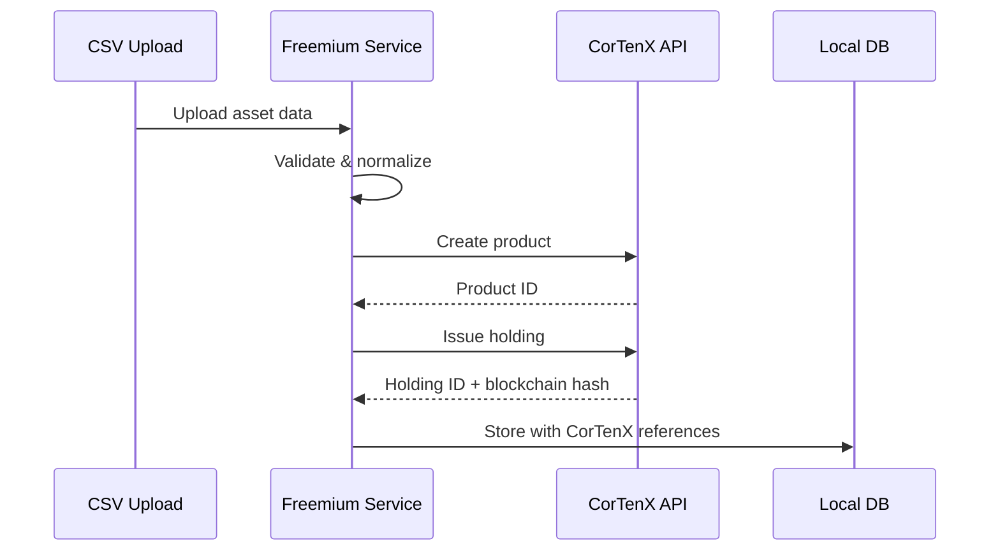
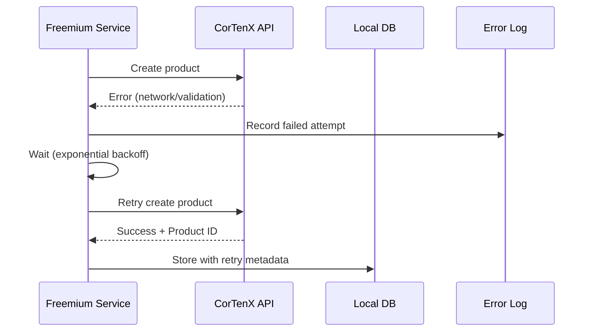

# CorTenX Integration Flow v1.0

## Overview
This sequence diagram shows the flow of asset creation and synchronization with the CorTenX blockchain ledger.

## Asset Creation Flow

## Integration Points

### **1. Data Upload**
- User uploads CSV with asset inventory
- Freemium validates file format and data quality
- Normalization process enriches data with ESG metadata

### **2. CorTenX Product Creation**
- Asset data transformed to CorTenX product format
- Product created via CorTenX API with ESG attributes
- Unique product ID returned for reference

### **3. Holdings Issuance**
- Asset quantity converted to CorTenX holding
- Blockchain transaction creates immutable record
- Cryptographic hash provides audit proof

### **4. Local Storage**
- Freemium stores CorTenX references locally
- Enables fast queries while maintaining blockchain link
- Audit trail accessible via CorTenX proof URLs

## Error Handling

## Performance Considerations

### **Batch Processing**
- Multiple assets processed in parallel
- Configurable batch size (default: 100 assets)
- Progress tracking for large imports

### **Caching Strategy**
- Redis cache for CorTenX product lookups
- 5-minute TTL for frequently accessed data
- Background refresh for critical assets

### **Retry Logic**
- Exponential backoff for network failures
- Maximum 3 retry attempts per operation
- Circuit breaker for sustained failures

## Security Model

### **Authentication**
- CorTenX API requires access token authentication
- Tokens stored securely in environment variables
- Automatic token refresh with 24-hour expiry

### **Authorization**
- Role-based permissions mapped to CorTenX capabilities
- Tenant isolation via separate CorTenX accounts
- Audit logging for all blockchain operations

## Monitoring & Observability

### **Key Metrics**
- `cortenx_api_requests_total` - Total API calls by endpoint
- `cortenx_sync_duration_seconds` - Time to sync assets
- `cortenx_blockchain_verification_status` - Success rate

### **Alerts**
- API downtime > 2 minutes (critical)
- Sync lag > 5 minutes (warning)
- Verification failures > 5% (warning)

## Status
- **Version**: v1.0
- **Created**: 2025-06-14
- **Owner**: James
- **Review Status**: Extracted from technical specification
- **Referenced in**: `specs/cortenx_integration.md` 