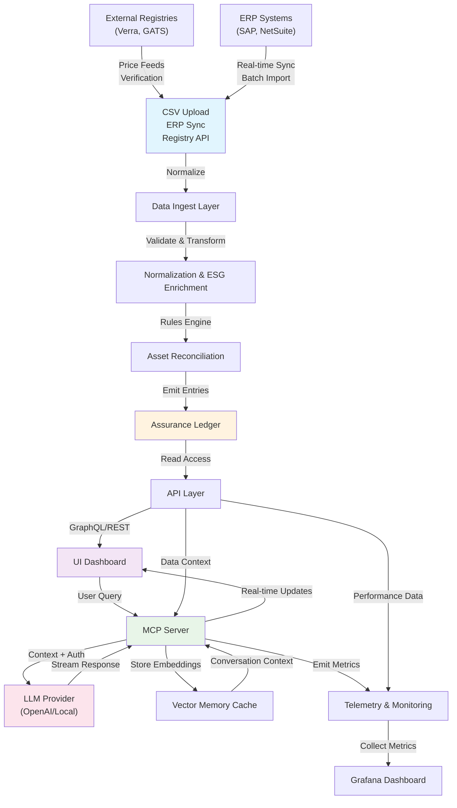

# Freemium Architecture Flow Diagram v1.0

## Overview
This diagram illustrates the comprehensive data flow through the Freemium platform, from ingestion to user interaction.

## Mermaid Source

## Data Flow Description

### 1. Data Ingestion (Left Side)
- **Multiple Sources**: CSV files, ERP systems, and external registries feed into the platform
- **Normalization**: Raw data is validated, transformed, and enriched with ESG metadata
- **Reconciliation**: Rules engine processes assets and emits entries to the assurance ledger

### 2. User Interaction (Right Side)  
- **Dashboard UI**: Users interact through React-based interface
- **MCP Server**: Handles LLM interactions with proper auth and context packaging
- **Streaming**: Real-time responses from LLM providers (OpenAI or local models)

### 3. Core Data Store
- **Assurance Ledger**: Central repository of reconciled asset data
- **API Layer**: GraphQL/REST endpoints for data access
- **Vector Cache**: Conversation context for efficient follow-up queries

### 4. External Integrations
- **Registry APIs**: Real-time price feeds and certificate verification
- **ERP Sync**: Scheduled and real-time data synchronization
- **Monitoring**: Comprehensive telemetry collection and visualization

## Performance Annotations

### Latency Targets (p95)
- **MCP Server**: ≤ 200ms request→first-token
- **API Layer**: ≤ 100ms for standard queries
- **Data Ingestion**: ≤ 5s for CSV uploads (< 100MB)
- **ERP Sync**: ≤ 30s for batch operations

### Data Contracts
- **CSV Ingest**: UTF-8, max 500k rows, structured ESG metadata
- **ERP APIs**: OAuth2/API key auth, rate-limited, incremental sync
- **Registry APIs**: Certificate verification, price feeds, compliance data

## Security Boundaries
- **Tenant Isolation**: All data access scoped by tenant_id
- **Authentication**: JWT tokens for API access, mTLS for ERP connections
- **Data Protection**: Encryption at rest/transit, no cloud egress in desktop mode

## Technology Stack Mapping
- **Ingest Layer**: Kotlin/Spring Boot microservices
- **UI Layer**: React/Next.js with Vercel deployment
- **MCP Server**: Node.js/TypeScript with WebSocket streaming
- **Storage**: SQLite (desktop) / PostgreSQL (SaaS)
- **Vector Store**: SQLite-VSS (desktop) / pgvector (SaaS)

## Status
- **Version**: v1.0
- **Created**: 2025-06-14
- **Owner**: James
- **Review Status**: Ready for team review 