# Data Flow Diagram v1

## Overview
This diagram illustrates the complete end-to-end data flow in the Freemium platform's Basic release, from data ingestion through CorTenX blockchain integration to final user outputs. This shows the local deployment (desktop/Docker) with cloud connectivity for CorTenX blockchain and external integrations.

## Data Flow Diagram

```mermaid
flowchart TD
    %% Data Sources
    CSV[📄 CSV Files]
    ERP[🏢 ERP Systems]
    REG[🌍 Carbon/REC Registries]
    
    %% Ingestion Layer
    INGEST{📥 Data Ingestion Layer}
    CSV --> INGEST
    ERP --> INGEST
    REG --> INGEST
    
    %% Normalization & Processing
    NORM[🔄 Data Normalization<br/>& ESG Enrichment]
    INGEST --> NORM
    
    %% Rules Engine
    RULES[⚙️ Rules Engine<br/>Asset Reconciliation]
    NORM --> RULES
    
    %% CorTenX Integration (Cloud-based)
    CORTENX[🔗 CorTenX Cloud API<br/>Blockchain Ledger]
    RULES --> CORTENX
    
    %% Local Storage Layer
    STORAGE[(💾 SQLite Database<br/>Local Caching)]
    RULES --> STORAGE
    CORTENX --> STORAGE
    
    %% Optional MCP Server Integration
    MCP[🤖 MCP Server<br/>Optional Add-on]
    STORAGE --> MCP
    
    %% API Layer
    API[🔌 REST/GraphQL APIs<br/>Versioned Endpoints]
    STORAGE --> API
    MCP --> API
    
    %% Frontend Applications
    UI[🖥️ React/Next.js Frontend<br/>Dashboard Interface]
    API --> UI
    
    %% User Outputs
    DASHBOARD[📊 Heat-Map &<br/>Variance Dashboard]
    PDF[📋 PDF Reports<br/>Audit-Ready]
    CHAT[💬 LLM Chat Interface<br/>Optional Add-on]
    
    UI --> DASHBOARD
    UI --> PDF  
    UI -.->|Optional| CHAT
    
    %% User Interaction
    USER[👤 End User<br/>ESG/Sustainability Teams]
    DASHBOARD --> USER
    PDF --> USER
    CHAT -.->|Optional| USER
    
    %% Feedback Loop
    USER -.->|Upload Data| CSV
    USER -.->|Configure Rules| RULES
    USER -.->|Optional Queries| MCP
    
    %% Cloud Connectivity
    CLOUD{☁️ Internet<br/>Connectivity}
    ERP --> CLOUD
    REG --> CLOUD
    CORTENX --> CLOUD
    
    %% Styling
    classDef source fill:#e1f5fe
    classDef process fill:#f3e5f5
    classDef blockchain fill:#ff9999
    classDef storage fill:#e8f5e8
    classDef output fill:#fff2cc
    classDef user fill:#f0f4c3
    classDef cloud fill:#e3f2fd
    classDef optional fill:#f1f8e9
    
    class CSV,ERP,REG source
    class INGEST,NORM,RULES,API,UI process
    class CORTENX blockchain
    class STORAGE storage
    class DASHBOARD,PDF output
    class USER user
    class CLOUD cloud
    class MCP,CHAT optional
```

## Key Components

### **Data Sources**
- **CSV Files**: Manual data uploads via file interface
- **ERP Systems**: Automated synchronization via REST/GraphQL APIs
- **Carbon/REC Registries**: Real-time data pulls from environmental registries

### **Processing Pipeline**
1. **Data Ingestion Layer**: Modular connectors normalize different data formats
2. **ESG Enrichment**: Adds metadata, calculations, and compliance markers
3. **Rules Engine**: Reconciles assets, validates data, triggers blockchain events
4. **CorTenX Integration**: Creates immutable audit trail on blockchain ledger

### **Deployment Architecture**
- **Local Deployment**: Desktop application OR Docker container (both provide localhost web interface)
- **Cloud Connectivity**: Required for CorTenX blockchain and external integrations (ERP/Registry APIs)
- **Local Storage**: SQLite database for performance caching and offline viewing

### **User Interface Layer**
- **REST/GraphQL APIs**: Versioned endpoints for all platform functionality
- **React Frontend**: Modern dashboard with real-time updates via localhost web interface
- **MCP Server**: Optional add-on for LLM-powered natural language querying

### **User Outputs**
- **Heat-Map Dashboard**: Visual representation of asset distribution and ESG metrics
- **Variance Dashboard**: Identifies discrepancies in environmental asset reporting
- **PDF Reports**: Audit-ready compliance documents with CorTenX blockchain verification
- **LLM Chat**: Optional natural language queries for complex data analysis

## Data Flow Patterns

### **Primary Flow**: CSV Upload → Report Generation
1. User uploads CSV file to local application
2. System normalizes and enriches data locally
3. Rules engine reconciles assets
4. CorTenX cloud API records immutable blockchain entries
5. User generates PDF report with blockchain verification

### **API Integration Flow**: ERP Sync → Dashboard Updates
1. Local application connects to ERP systems via internet
2. Real-time data processing and reconciliation in local SQLite
3. CorTenX cloud API updates blockchain ledger
4. Dashboard automatically updates with new metrics and alerts

### **Query Flow**: User Question → LLM Response (Optional Add-on)
1. User asks natural language question via chat interface
2. MCP server packages context with current SQLite data state
3. LLM (cloud or local) processes query against ESG asset database
4. Structured response with data citations returned

## Performance Targets
- **End-to-End Latency**: ≤30 minutes from CSV upload to audit-ready report
- **API Response Time**: ≤200ms p95 for dashboard queries
- **CorTenX Integration**: ≤5s for blockchain ledger updates
- **Internet Dependency**: Core features require connectivity for CorTenX and external integrations

## Status
- **Version**: 1.1
- **Created**: 2025-06-14
- **Updated**: 2025-06-14
- **Owner**: James
- **Review Status**: Updated to reflect local+cloud hybrid architecture
- **Dependencies**: CorTenX Cloud API, External integrations (ERP/Registry), Optional MCP Server 