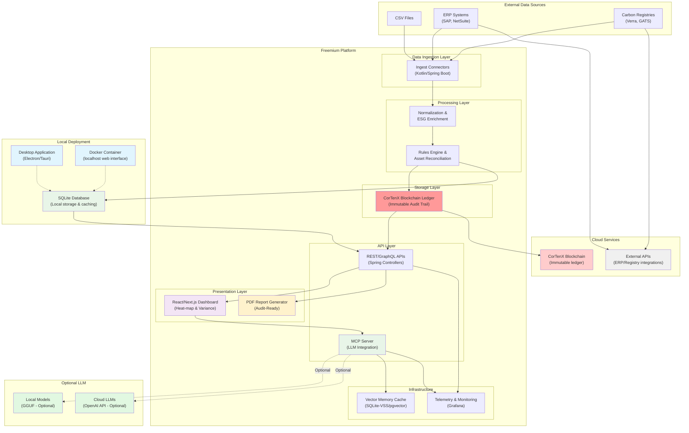

# Freemium System Architecture v1.0

## Overview
This diagram illustrates the high-level system architecture of the Freemium platform, showing all layers, components, and their interactions.

## System Architecture Diagram

## Architecture Principles

### **Modular Design**
Each layer can be developed and deployed independently, enabling:
- Parallel development across teams
- Independent scaling of components
- Easier testing and maintenance

### **CorTenX Integration** 
Blockchain ledger provides immutable audit trail with:
- Cryptographic proof of data integrity
- Tamper-proof ESG compliance records
- Multi-party trust and verification

### **Local+Cloud Hybrid**
Local deployment with selective cloud connectivity:
- **Desktop/Docker**: SQLite + localhost web interface for control and privacy
- **Cloud Services**: CorTenX blockchain + external integrations for functionality
- **Optional LLM**: Local GGUF models or cloud APIs as add-on feature

### **API-First Architecture**
All functionality accessible via versioned APIs:
- REST/GraphQL endpoints for standard operations
- WebSocket for real-time LLM interactions
- OpenAPI documentation auto-generated

### **LLM-Enhanced**
MCP server provides intelligent query capabilities:
- Context-aware responses using vector memory
- Streaming for real-time user experience
- Offline parity with local models

## Component Descriptions

### **Data Ingestion Layer**
- **Ingest Connectors**: Modular connectors for different data sources
- **Technology**: Kotlin/Spring Boot microservices
- **Capability**: CSV, ERP API, Registry API integration

### **Processing Layer**
- **Normalization**: Transform raw data into standard ESG format
- **Rules Engine**: Asset reconciliation and validation logic
- **ESG Enrichment**: Add sustainability metadata and calculations

### **Storage Layer**
- **CorTenX Blockchain**: Immutable ledger for audit-grade compliance
- **Capabilities**: Cryptographic proof, multi-signature transactions
- **Integration**: Via CorTenX API for seamless blockchain operations

### **API Layer**
- **REST/GraphQL APIs**: Standard data access and manipulation
- **MCP Server**: Model Context Protocol for LLM interactions
- **Authentication**: JWT/OAuth2 with role-based access control

### **Presentation Layer**
- **Dashboard**: React/Next.js with heat-map and variance views
- **PDF Generator**: Audit-ready reports with blockchain verification
- **Real-time Updates**: WebSocket integration for live data

### **Infrastructure**
- **Vector Memory**: Conversation context for efficient LLM follow-ups
- **Monitoring**: Comprehensive telemetry and alerting via Grafana
- **Caching**: Redis for performance optimization

## Data Flow

### **Ingestion → Processing**
1. External data sources feed into ingest connectors
2. Raw data is validated and normalized
3. Rules engine processes and reconciles assets
4. Results are committed to CorTenX blockchain

### **Storage → Presentation**
1. CorTenX blockchain provides verified data
2. API layer exposes data via REST/GraphQL
3. UI components consume APIs for dashboard views
4. PDF generator creates audit reports with blockchain proof

### **User Interaction**
1. Users interact with React dashboard
2. Queries are sent to MCP server
3. MCP server packages context and calls LLM
4. Streaming responses provide real-time interaction

## Deployment Architecture

### **Local Deployment Options**
- **Desktop Application**: Electron/Tauri standalone executable
- **Docker Container**: Containerized deployment with localhost web interface
- **Database**: SQLite for local storage and performance caching
- **Web Interface**: React/Next.js accessible via localhost
- **Advantages**: User control, data privacy, offline viewing capabilities

### **Cloud Connectivity**
- **CorTenX Blockchain**: Immutable ledger for audit-grade compliance
- **External Integrations**: ERP systems and registry APIs
- **Optional LLM**: Cloud APIs or local GGUF models as add-on
- **Requirements**: Internet connectivity for blockchain and external data

## Performance Targets

### **Latency (p95)**
- **MCP Server**: ≤ 200ms request→first-token
- **API Layer**: ≤ 100ms for standard queries
- **Data Ingestion**: ≤ 5s for CSV uploads (< 100MB)
- **ERP Sync**: ≤ 30s for batch operations

### **Throughput**
- **Concurrent Users**: 50+ per tenant
- **API Requests**: 1000+ requests/minute
- **Data Processing**: 500k+ rows/hour

## Security Boundaries

### **Local Data Protection**
- SQLite database with encryption at rest
- Localhost-only web interface access
- No multi-tenant data mixing
- Blockchain entries cryptographically signed

### **Cloud Connectivity Security**
- Encryption in transit (TLS 1.3) for all cloud connections
- JWT/OAuth2 authentication for CorTenX and external APIs
- mTLS for ERP connections
- Selective cloud egress only for blockchain and integrations

## Technology Stack

### **Backend**
- **Language**: Kotlin 17
- **Framework**: Spring Boot 3.x
- **Database**: SQLite for local storage and caching
- **Blockchain**: CorTenX API integration

### **Frontend** 
- **Framework**: React/Next.js
- **Deployment**: Electron (desktop) / Docker (container)
- **Interface**: Localhost web interface
- **Styling**: Tailwind CSS
- **Charts**: D3.js / Chart.js

### **Infrastructure**
- **Containerization**: Docker + Docker Compose (optional deployment)
- **Monitoring**: Local telemetry and health checks
- **Logging**: Application logs with configurable levels
- **CI/CD**: GitHub Actions for builds and releases

## Status
- **Version**: v1.0
- **Created**: 2025-06-14
- **Owner**: James
- **Review Status**: Ready for team review
- **Next Update**: After CorTenX integration POC 