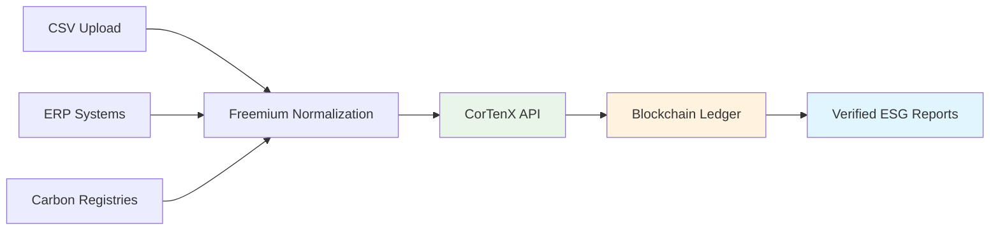

# Freemium ESG Platform: Executive Brief

## Executive Summary

**Freemium positions CorTenX as the blockchain infrastructure leader for ESG compliance** - a $3B+ market with regulatory tailwinds and enterprise demand.

### Strategic Opportunity
- **First-to-market** blockchain-verified ESG platform
- **Multiple partners ready** for distribution
- **Desktop-first deployment** bypasses enterprise procurement delays
- **Existing CorTenX API** provides immediate technical foundation

### Business Impact
- **Premium pricing**: 2-3x higher than traditional ESG platforms
- **Competitive moat**: Unassailable blockchain verification advantage  
- **Market expansion**: Positions CorTenX in high-growth ESG vertical
- **Reference architecture**: Reusable pattern for ESG industry

---

## Market Context: The ESG Compliance Crisis

### Regulatory Pressure
- **EU CSRD**: Mandatory sustainability reporting for 50,000+ companies by 2024
- **SEC Climate Rules**: US public companies must disclose Scope 1-3 emissions
- **Audit Requirements**: Increasing scrutiny on ESG data accuracy and provenance

### Current Market Gaps
- **Data Integrity**: Spreadsheet-based tracking lacks audit trails
- **Trust Issues**: No verification of supply chain sustainability claims
- **Compliance Costs**: Manual processes are expensive and error-prone
- **Competitive Disadvantage**: ESG leaders gain market advantages

### Market Size
- **Total Addressable Market**: $3.2B (ESG reporting software)
- **Obtainable Market**: $180M (audit-grade ESG platforms)
- **First-Mover Advantage**: No blockchain-verified ESG platforms exist

---

## Solution: Freemium ESG Platform

### Core Value Proposition
**The only ESG platform providing blockchain-verified sustainability data with cryptographic proof for auditors.**

### Key Differentiators
1. **Immutable Audit Trail** - CorTenX blockchain ensures tamper-proof ESG data
2. **Cryptographic Verification** - Mathematical proof of data integrity for auditors
3. **Multi-Party Trust** - Suppliers, companies, and auditors share verified data
4. **Desktop Deployment** - Fast customer adoption bypassing IT procurement

### Target Customers
- **Primary**: Mid-market companies (500-5000 employees) facing new ESG regulations
- **Secondary**: ESG consultancies needing audit-grade data for clients
- **Tertiary**: Large enterprises seeking competitive ESG advantage

---

## Technical Foundation: CorTenX API Integration

### Existing API Capabilities Demonstrate Feasibility

#### 1. Asset Tokenization
```json
// CREATE ESG ASSET (using existing /api/auth/tx/async)
{
  "request": {
    "type": "CreateProductRequest",
    "code": "CORN-US-2024-001",
    "name": "US Organic Corn - 1000 tonnes",
    "attributes": {
      "asset_type": "commodity",
      "quantity": 1000,
      "unit": "tonnes",
      "emission_factor": 2.45,
      "origin_country": "US",
      "certification": "USDA Organic"
    }
  }
}
```

#### 2. Blockchain Verification
```json
// AUDIT TRAIL (using existing /api/pub/holdings)
{
  "holdings": [{
    "holdingId": "41756:0",
    "productId": "41755:0", 
    "issuedIn": "0x233c04beef01370ef4b0e2bb6301cda077666ed81a76dc5e93aacd830e59bb36",
    "issuedTime": "2024-06-14T10:30:00Z",
    "quantity": 1000,
    "state": "Unspent",
    "product": {
      "attributes": {
        "emission_factor": 2.45,
        "certification": "USDA Organic"
      }
    }
  }]
}
```

#### 3. ESG Reporting
```json
// VERIFIED ESG REPORT (aggregated from existing APIs)
{
  "report_id": "ESG-2024-Q2",
  "total_emissions": 24500.0,
  "blockchain_verified": true,
  "assets": [
    {
      "asset_id": "CORN-US-2024-001",
      "quantity": 1000,
      "emissions": 2450.0,
      "verification_hash": "0x233c04beef...59bb36",
      "blockchain_proof_url": "https://corten-demo.dev.trovio.io/proof/41756:0"
    }
  ]
}
```

### Technical Architecture


---

## Competitive Advantage Analysis

### Traditional ESG Platforms
| Capability | Traditional Platforms | Freemium + CorTenX |
|------------|----------------------|---------------------|
| Data Storage | SQL Database | Blockchain Ledger |
| Audit Trail | Application Logs | Cryptographic Proof |
| Data Integrity | "Trust us" | Mathematical Verification |
| Multi-Party Trust | Data Silos | Shared Truth |
| Compliance | Manual Attestation | Automated Verification |

### Market Positioning

#### **"Trust But Verify" → "Don't Trust, Verify"**

**Traditional Approach:**
> "Our platform ensures data accuracy through access controls and audit logs."

**Freemium + CorTenX:**
> "Our platform provides mathematical proof of data integrity through blockchain verification."

---

## Business Model & Pricing

### Revenue Streams
1. **SaaS Subscriptions**: $50-500/month per company (desktop → cloud upsell)
2. **Transaction Fees**: $0.10 per verified ESG transaction
3. **Partner Revenue Share**: 30% of partner-distributed licenses
4. **Enterprise Consulting**: Custom implementation services

### Pricing Strategy
- **Freemium Desktop**: Free (up to 100 assets)
- **Professional**: $200/month (up to 10k assets)  
- **Enterprise**: $2000/month (unlimited + white-label)
- **Audit Premium**: +50% for blockchain verification features

### Financial Projections
- **Year 1**: $500K ARR (100 customers, avg $5K/year)
- **Year 2**: $2.5M ARR (500 customers, partner channel)
- **Year 3**: $8M ARR (1000+ customers, enterprise contracts)

---

## Go-to-Market Strategy

### Phase 1: Desktop Launch (Q3 2025)
- **Target**: 100 early adopter companies
- **Channel**: Direct sales + sustainability consultancies
- **Positioning**: "First blockchain-verified ESG platform"

### Phase 2: Partner Distribution (Q4 2025)  
- **Target**: 500 companies via partner channels
- **Channels**: ESG consultancies, accounting firms, sustainability software vendors
- **Positioning**: "Infrastructure for trusted ESG data"

### Phase 3: Enterprise Expansion (Q1 2026)
- **Target**: Fortune 500 companies with complex ESG requirements
- **Channels**: Enterprise sales, system integrators
- **Positioning**: "Platform for regulatory-grade ESG compliance"

### Partner Readiness
- **Multiple partners confirmed** and ready for distribution
- **White-label capabilities** for partner customization
- **Revenue sharing models** established

---

## Technical Roadmap: Existing CorTenX → Full Integration

### Phase 1: Proof of Concept (4 weeks)
**Using Existing CorTenX API:**
- Basic asset creation via existing endpoints
- CSV import → CorTenX product creation
- Simple ESG report with blockchain references

### Phase 2: Production MVP (8 weeks)
**Enhanced CorTenX Integration:**
- Batch asset processing
- ERP system connectors
- Desktop packaging and distribution

### Phase 3: Advanced Features (8 weeks)
**Optimized CorTenX Usage:**
- Real-time ESG dashboards
- Multi-party verification workflows
- Advanced audit trail features

### Development Resources
- **Existing CorTenX API**: Immediate development possible
- **Internal CorTenX Support**: Accelerated timeline vs external integration
- **Partner Distribution**: Ready channels for rapid deployment

---

## Risk Assessment

### Technical Risks
- **CorTenX Performance**: High-volume ESG data processing
  - *Mitigation*: Load testing with existing API
- **Integration Complexity**: Desktop deployment with blockchain
  - *Mitigation*: Phased rollout, existing API validation

### Market Risks  
- **Competition**: Traditional vendors adding blockchain features
  - *Mitigation*: First-mover advantage, superior technical foundation
- **Regulatory Changes**: ESG requirements evolving
  - *Mitigation*: Flexible platform, blockchain future-proofs compliance

### Business Risks
- **Customer Adoption**: Blockchain complexity concerns
  - *Mitigation*: Desktop-first reduces technical barriers
- **Partner Execution**: Distribution partner performance
  - *Mitigation*: Multiple partner channels, direct sales backup

---

## Investment Requirements

### Development Investment
- **Phase 1**: $150K (4 weeks, existing API)
- **Phase 2**: $400K (8 weeks, production MVP)
- **Phase 3**: $500K (8 weeks, advanced features)
- **Total**: $1.05M over 20 weeks

### Expected Returns
- **Year 1 ROI**: 48% ($500K revenue / $1.05M investment)
- **Year 2 ROI**: 240% ($2.5M revenue)
- **Year 3 ROI**: 760% ($8M revenue)

### Strategic Value
- **Market Leadership**: First-mover in blockchain ESG
- **CorTenX Positioning**: Establishes ESG vertical dominance
- **Technology Moat**: Competitive advantage for 3-5 years

---

## Recommended Next Steps

### Immediate Actions (Next 2 Weeks)
1. **Executive Approval**: CEO/CTO alignment on strategic direction
2. **CorTenX Engineering**: Technical feasibility validation
3. **Partner Coordination**: Distribution readiness assessment
4. **Resource Allocation**: Development team assignment

### Success Metrics
- **Technical**: Working MVP using existing CorTenX API within 4 weeks
- **Business**: First paying customer within 8 weeks  
- **Strategic**: Partner distribution launch within 12 weeks

### Decision Points
- **Go/No-Go**: Executive approval for $1M investment
- **Resource Commitment**: Engineering team allocation
- **Timeline**: Accelerated vs standard development approach

---

## Conclusion

**Freemium represents a strategic opportunity to position CorTenX as the blockchain infrastructure leader for ESG compliance.**

### Why Now?
- **Regulatory tailwinds** driving demand for audit-grade ESG data
- **Existing CorTenX API** provides immediate technical foundation
- **Partner channels ready** for rapid market distribution
- **No blockchain competitors** in ESG space

### Strategic Impact
- **Revenue Growth**: New high-value market vertical
- **Technology Leadership**: First blockchain ESG platform
- **Competitive Moat**: 3-5 year technical advantage
- **Industry Standard**: CorTenX as ESG infrastructure

**The combination of market demand, technical readiness, and distribution partners creates a unique window for market leadership. The existing CorTenX API provides the foundation to move quickly while competitors struggle with blockchain integration.**

---

**Status**: Ready for CEO/CTO Review  
**Date**: June 14, 2025  
**Owner**: James Hassett, Product Manager  
**Next Step**: Executive alignment meeting 